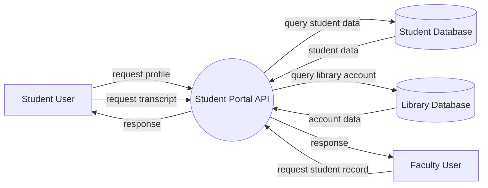

# CYSE 411 – Threat Modeling and Risk Evaluation Assignment

## Real-World Inspired Case: University Student Portal Data Exposure

### Background

Several universities and online platforms have experienced **data exposure incidents caused by Broken Access Control vulnerabilities**, particularly **Insecure Direct Object References (IDOR)**.

In multiple bug bounty reports and academic systems, attackers discovered that web applications exposed predictable identifiers in URLs or APIs. If the backend does not verify authorization properly, attackers can manipulate these identifiers to retrieve information belonging to other users.

Examples of vulnerable endpoints observed in real systems include:

```
GET /api/student/profile/{student_id}
GET /api/student/transcript/{student_id}
GET /api/library/account/{student_id}
```

In these cases, the system verifies that the user is **authenticated**, but fails to verify that the user is **authorized to access the requested resource**.

Attackers with a legitimate account can modify identifiers such as `student_id` and retrieve sensitive data belonging to other users.

This class of vulnerability is one of the most common issues in modern web systems and appears in the **OWASP Top 10 as Broken Access Control**.

Reference:

OWASP Top 10 – Broken Access Control  
https://owasp.org/www-project-top-ten/

---

# System Description

The university provides an online **Student Portal** that allows authenticated users to access several services.

The portal provides the following functionality:

- Students can view their personal profile
- Students can retrieve their academic transcripts
- Students can view their library account activity
- Faculty can access course rosters
- Administrative staff can manage student records

The system architecture includes:

**Components**

- Web browser (client)
- Student Portal API
- Student Database
- Library Database

---

# System Data Flow Diagram



---

# Trust Boundary

A critical trust boundary exists between:

```
User Browser → Backend API
```

All requests crossing this boundary must be:

- validated
- authenticated
- authorized

Failure to enforce these controls may allow attackers to manipulate requests.

---

# Part 1 – Threat Elicitation

Based on the system description, identify **up to five possible threats**.

You may consider attacker models such as:

- Authenticated malicious user
- External attacker
- Insider with legitimate access
- Automated script or bot

Hints:

Possible attack ideas include:

- Manipulating API identifiers
- Enumerating student IDs
- Automating data harvesting
- Accessing unauthorized records
- Abusing API endpoints

### Threat Enumeration Table

Students must identify **up to five threats**.

| Actor | Prerequisites | Actions | Consequence | Affected System Component | Impact |
|------|---------------|--------|-------------|---------------------------|--------|
| | | | | | |
| | | | | | |
| | | | | | |
| | | | | | |
| | | | | | |

---

# Part 2 – Threat Ranking Using DREAD

Threat modeling identifies possible attacks, but organizations must determine **which threats are the most critical**.

Threat ranking allows engineers to prioritize mitigation efforts.

One method historically used in Microsoft’s Secure Development Lifecycle is **DREAD**.

DREAD evaluates threats using five criteria.

| Criterion | Description |
|-----------|-------------|
| Damage | How severe would the attack be? |
| Reproducibility | How easily can the attack be repeated? |
| Exploitability | How difficult is it to perform the attack? |
| Affected Users | How many users are impacted? |
| Discoverability | How easy is it to discover the vulnerability? |

Each criterion is scored between **0 and 10**.

---

# Part 3 – Bug Bar Definition

A **Bug Bar** is a set of predefined thresholds used by organizations to classify the severity of vulnerabilities.

Bug Bars help teams:

- standardize vulnerability scoring
- prioritize remediation
- ensure consistent security decisions

For example, the Bug Bar for **Damage** might look like:

| Score | Interpretation |
|------|---------------|
| 0 | No damage |
| 5 | Limited information disclosure |
| 8 | Exposure of sensitive personal data |
| 10 | Complete system compromise |

Students must construct similar Bug Bars for:

- Reproducibility
- Exploitability
- Affected Users
- Discoverability

---

# Part 4 – Deriving Likelihood and Impact

Many risk models simplify risk as:

```
Risk = Likelihood × Impact
```

However, DREAD provides **five dimensions**, not two.

Your task is to design a method to convert DREAD into **Likelihood** and **Impact**.

Example reasoning:

```
Likelihood = f(Reproducibility, Exploitability, Discoverability)

Impact = f(Damage, Affected Users)
```

Students must:

1. Propose a formula for computing likelihood
2. Propose a formula for computing impact
3. Explain the reasoning behind their design
4. Justify any weighting applied

Example (students may propose alternatives):

```
Likelihood = (R + E + Dv) / 3

Impact = (D + A) / 2
```

Where:

```
D  = Damage
R  = Reproducibility
E  = Exploitability
A  = Affected Users
Dv = Discoverability
```

---

# Part 5 – Applying DREAD

Use your Bug Bar definitions and formulas to evaluate the threats you previously identified.

| Threat | Damage | Reproducibility | Exploitability | Affected Users | Discoverability | Risk Score |
|------|------|------|------|------|------|------|
| Threat 1 | | | | | | |
| Threat 2 | | | | | | |
| Threat 3 | | | | | | |
| Threat 4 | | | | | | |
| Threat 5 | | | | | | |

---

# Risk Classification

| Risk Score | Classification |
|------------|---------------|
| 8 – 10 | High |
| 5 – 7.9 | Medium |
| 0 – 4.9 | Low |

---

# Part 6 – Threat Mitigation

For each threat identified, propose **security controls**.

Your controls must include at least one example of each type.

| Control Type | Description |
|--------------|-------------|
| Preventive | Prevent the attack from occurring |
| Detective | Detect attacks in progress |
| Corrective | Restore the system after an incident |

### Mitigation Table

| Threat | Preventive Control | Detective Control | Corrective Control |
|------|------|------|------|
| Threat 1 | | | |
| Threat 2 | | | |
| Threat 3 | | | |
| Threat 4 | | | |
| Threat 5 | | | |

---

# Reflection Questions

Answer the following:

1. Which threats had the highest risk score and why?
2. Which DREAD criteria influenced the result the most?
3. Do you think DREAD introduces subjectivity? Explain.
4. How could system architecture changes reduce these risks?

---

# Submission

Students must submit:

1. Completed threat enumeration table
2. Bug Bar definitions
3. Likelihood and Impact formulas
4. DREAD evaluation table
5. Mitigation analysis
6. Reflection answers